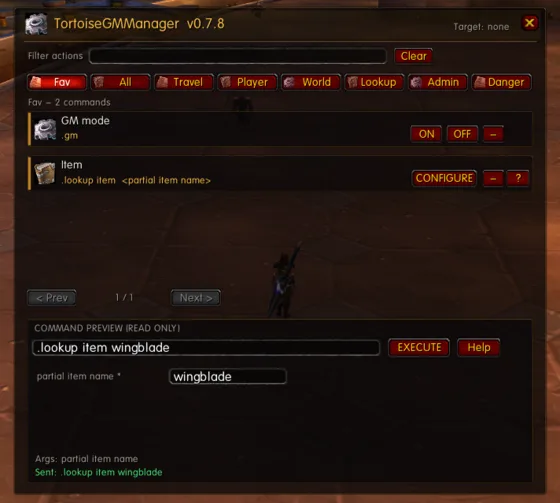
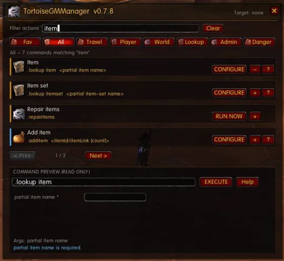
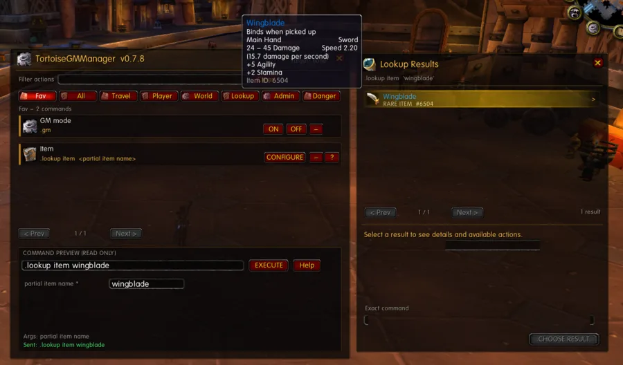

# TortoiseGMManager

<p align="center">
  
</p>

A compact, Vanilla-native GM command manager for **Tortoise WoW 1.18.1 / client build 7272**.

TortoiseGMManager turns the server's dot-prefixed GM commands into a small searchable in-game interface. It is intended for local/private Tortoise WoW server administration and testing: teleporting, player/NPC management, items and spells, quests, gameobjects, lookups, moderation, server commands, and other common GM workflows.

The addon is **client-side only**. It does not connect directly to MariaDB and does not bypass server permissions. Commands are sent through the normal GM chat-command path; the world server remains authoritative for access level, syntax, and database state.

## Screenshots

<table>
  <tr>
    <td width="50%" align="center">
      <br>
      <sub><b>Favourites</b> — keep frequently used actions together.</sub>
    </td>
    <td width="50%" align="center">
      <br>
      <sub><b>Search</b> — filter the command catalogue as you type.</sub>
    </td>
  </tr>
</table>

<p align="center">
  <br>
  <sub><b>Item lookup</b> — search by partial name, inspect item details, and act on the selected result.</sub>
</p>

## Features

- Compact structured command palette sized for common 1024x768 Vanilla layouts.
- Draggable minimap launcher; **Shift-drag** moves it and the position is saved.
- `/tgmm` opens the manager.
- Fav, All, Travel, Player, World, Lookup, Admin and Danger categories. Fav opens by default when populated; otherwise All opens.
- **Filter actions** searches the catalogue with label-first ranking; it never changes the executable command.
- Uses stock interface icons and textures provided by the installed Vanilla WoW client; no game texture files are bundled, and no Ace or LibDBIcon dependency is required.
- The exact GM command is shown in a read-only preview before execution; purpose-specific controls build it safely.
- Current target is shown in the header.
- Detailed descriptions, access levels and argument help live in hover tooltips instead of filling the panel.
- `?` asks the server for `.help <command>`.
- Add or remove frequently used actions with each row's `+`/`-` control; favourites and window/minimap positions persist in `TortoiseGMManagerDB`.
- Argument-free safe actions use one-click **RUN NOW**; simple state commands expose direct **ON/OFF** buttons; configurable actions open typed number, text, and lookup-ID controls.
- Persistent/destructive operations require the exact same command to be **EXECUTE**d twice within five seconds.
- Esc closes addon windows through Vanilla `UISpecialFrames`.

## Database-aware lookup browser

Many GM commands require an ID even when you only know a name. Lookup-capable actions expose a dedicated name-or-ID field and **SEARCH** button, separate from the executable command bar.

Example:

```text
Add item -> type thunderfury in ITEM NAME OR ID -> SEARCH
```

The addon sends:

```text
.lookup item thunderfury
```

The server performs the lookup against its own loaded data. Matching `CHAT_MSG_SYSTEM` results are captured into a separate compact **Lookup Results** window with the result name, type and ID.

Click a result to select it. The results window then shows the originating action, up to three editable modifiers, validation, and the exact read-only command preview. Numeric fields accept arbitrary keyboard input (for example item counts `10` and `20`); `-` and `+` are optional conveniences. Enter runs a valid action.

Normal declared source actions execute directly in the results window. Dangerous actions retain the same two-click confirmation guard, with the action button changing to **CONFIRM ...**. Changing the result or any modifier clears confirmation. Standalone lookups remain informational and never invent an action; **LOAD COMMAND** is reserved for source actions that cannot safely execute in place.

Examples:

```text
item       -> .additem <id>
spell      -> .cast <id>
quest      -> .quest status <id>
creature   -> .go creature id <id>
gameobject -> .go object id <id>
event      -> .event info <id>
itemset    -> .additemset <id>
```

When SEARCH is launched from a specific action such as **Quest add**, **NPC add**, **Delete item**, **Add item set**, **Cast**, or **Set skill**, the selected result is loaded back into that original action instead.

The parser listens to `CHAT_MSG_SYSTEM`; it does not monkey-patch chat-frame `AddMessage` methods and does not suppress the original server response.

## Command coverage

The catalogue is checked against the command registry in the Shyalya `playerbots-integration-gh` branch built by `TortoiseWoWServer` by default.

Current development coverage is **150 presets** with **21 SEARCH mappings**, including common teleport and race-morph shortcuts plus the deployed core's NPC movement-type actions.

- GM mode, visibility, god mode, GPS, revive, replenish, repair, bank, mailbox and combat utilities.
- Saved teleports, player teleport/summon, coordinate movement, hover, waterwalk and taxi utilities.
- Items, item sets, spells, auras, cooldowns, skills, morph/demorph and level changes.
- NPC and gameobject lookup, spawn, movement, targeting and deletion workflows.
- Quest and event management.
- Item, spell, quest, creature, object, faction, skill, item-set, event and player/account lookups.
- Save/reload/server information and moderation commands.
- Shyalya commands such as `.learn all_myspells`, `.learn all_recipes`, `.learn all_trainer` and `.learn all_items`.

Commands not present in the current Shyalya registry are intentionally not advertised.

## Installation

### Downloading from GitHub

The addon files live at the repository root, so the downloaded folder **is** the addon folder.

1. Open the repository and choose **Code -> Download ZIP**.
2. Extract the downloaded archive.
3. Drag the extracted folder (e.g. `TortoiseGMManager-main`) straight into your client:

```text
<WoW>/Interface/AddOns/
```

WoW loads any folder that contains a `.toc` file, so the folder name does not need to match; you can keep `TortoiseGMManager-main` as-is or rename it to `TortoiseGMManager` if you prefer.

```text
<WoW>/Interface/AddOns/TortoiseGMManager/TortoiseGMManager.toc
```

4. Start or restart the WoW client.
5. On the character-selection screen, open **AddOns** and enable **TortoiseGMManager**.
6. If the client marks it as outdated, enable **Load out of date AddOns**. The manifest targets Vanilla interface `11200`.
7. Log into a GM character.
8. Click the gear icon next to the minimap, or run:

```text
/tgmm
```

### Minimap controls

```text
Click       open / close TortoiseGMManager
Shift-drag  move the minimap icon
```

The icon position and main-window position are saved automatically.

## Basic workflow

1. Select a player, NPC or object when the command is target-oriented.
2. Pick a category or use **All** and search.
3. **RUN NOW** executes safe actions that need no arguments in one row click without changing the composer.
4. State actions such as GM mode expose direct **ON/OFF** buttons. **CONFIGURE** opens structured controls for commands requiring values; every hinted syntax gets at least one matching input box.
5. The dedicated lookup field appears only for a lookup-capable action or when entering the Lookup tab. Type a name or ID and press Enter to search immediately; **SEARCH** remains available for mouse use.
6. Numeric IDs compose the originating action immediately; names are resolved through server-side lookup.
7. Click a lookup result; the lower panel immediately becomes the relevant action. Standalone item lookup defaults to Add Item, with editable quantity and an exact preview.
8. Press the action-specific button (for example **ADD ITEM**, **CAST**, or **SET SKILL**) or Enter. Dangerous actions require the same identical action twice within five seconds.

For server-specific syntax, hover the action or click `?` to request `.help` directly from the server.

## Safety model

Persistent/destructive operations are not one-click actions. Examples include server restart/shutdown, NPC/gameobject persistence changes, saved teleport changes, broad `learn all_*` operations, moderation actions, quest removal and `.die`.

For a dangerous command:

1. the first EXECUTE arms the exact command;
2. the same command must be EXECUTEd again within five seconds;
3. editing the command clears the pending confirmation.

Explicit cancellation commands such as `.server restart cancel` remain immediate.

## Server alignment

The addon is currently aligned against:

- `tortoise-wow-stack/TortoiseWoWServer`
- `Shyalya/tortoise-wow` on `playerbots-integration-gh`
- Command catalogue compatibility validated against server source commit `a6510bc4d8ecc48eac2a1d9a3a8b0610924d12fc`
- the `Penqle/tortoise-wow` lineage
- `tortoise-wow-stack/TortoiseWoWKnowledgeBase`

Relevant server command definitions live primarily in:

```text
src/game/Chat/Chat.cpp
src/game/Commands/Commands.cpp
src/game/ObjectMgr.cpp
```

`tests/verify_server_catalog.py` reconstructs the nested server command table and verifies addon presets, SEARCH routes, and displayed access levels against the configured source.

## Project structure

The addon files live at the repository root:

```text
TortoiseGMManager.toc
Data.lua        command catalogue and danger policy
Core.lua        execution, history, help and confirmation logic
Lookup.lua      lookup lifecycle and CHAT_MSG_SYSTEM parser
UI.lua          compact main palette and minimap launcher
ResultsUI.lua   separate lookup-results browser

tests/
  core_spec.lua
  lookup_spec.lua
  verify_server_catalog.py
```

## Development checks

```bash
npx --yes --package fengari-node-cli fengari tests/core_spec.lua
npx --yes --package fengari-node-cli fengari tests/lookup_spec.lua
python3 tests/verify_server_catalog.py

npx --yes luaparse -q Data.lua
npx --yes luaparse -q Core.lua
npx --yes luaparse -q Lookup.lua
npx --yes luaparse -q UI.lua
npx --yes luaparse -q ResultsUI.lua
```

The addon is statically and behavior tested in development, but still needs its first full visual/integration pass inside the actual Tortoise WoW 1.18.1 client.

## Project scope and affiliation

This repository contains client-addon source code, project artwork and
documentation screenshots. It does not distribute game-client binaries or
extracted game-data/texture files, provide hosting, or operate a game service.
It is not affiliated with or endorsed by Blizzard Entertainment or Turtle WoW.
World of Warcraft and related marks belong to their respective owners.

## Licence

Released under the [MIT License](LICENSE).
